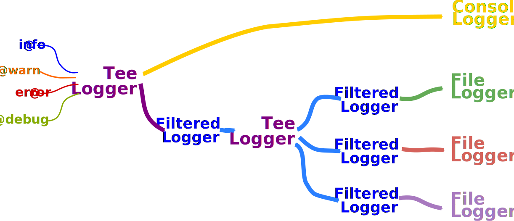

# LoggingExtras

[](https://travis-ci.org/oxinabox/LoggingExtras.jl)

[](http://codecov.io/github/oxinabox/LoggingExtras.jl?branch=master)




## Usage
Load the package with `using LoggingExtras`.
You likely also want to load the `Logging` standard lib.
Loggers can be constructed and used like normal.


### Basics of working with loggers
For full details, see the [Julia documentation on Logging](https://docs.julialang.org/en/v1/stdlib/Logging/index.html)

To use a `logger` in a given scope do
```
with_logger(logger) do
	#things
end
```

To make a logger the global logger, use
```
global_logger(logger)
```

to get the current global logger, use
```
logger = global_logger()
```

# Loggers introduced by this package:


This package introduces 3 new loggers.
The `DemuxLogger`, the `FilteredLogger` and the `FileLogger`.
All of them just wrap existing loggers.
The `DemuxLogger` sends the logs to multiple different loggers.
The `FilteredLogger` lets you add rules to cause a logger to ignore some inputs.


By combining `DemuxLogger` with `FilteredLogger`s you can arbitrarily route log messages, wherever you want.

The `FileLogger` is just a convience wrapper around the base julia `SimpleLogger`,
to make it easier to pass in a filename, rather than a stream.


## `DemuxLogger` and `FileLogger`

The `DemuxLogger` sends the log messages to multiple places.
It takes a list of loggers.
It also has the keyword argument `include_current_global`,
to determine if you also want to log to the global logger.

It is up to those loggers to determine if they will accept it.\
Which they do using their methods for `shouldlog` and `min_enabled_level`.
Or you can do, by wrapping them in a `FilteredLogger` as discussed below.

The `FileLogger` does logging to file.
It is really simple.
It takes a filename; and the minimum level it should log.

### Demo
We are going to log info and above to one file,
and warnings and above to another.

```
julia> using Logging; using LoggingExtras;

julia> demux_logger = DemuxLogger(
		FileLogger("info.log", min_level=Logging.Info),
		FileLogger("warn.log", min_level=Logging.Warn),
		include_current_global=false
		);


julia> with_logger(demux_logger) do
		@warn("It is bad")
		@info("normal stuff")
		@error("THE WORSE THING")
		@debug("it is chill")
	end

shell>  cat warn.log
┌ Warning: It is bad
└ @ Main REPL[34]:2
┌ Error: THE WORSE THING
└ @ Main REPL[34]:4

shell>  cat info.log
┌ Warning: It is bad
└ @ Main REPL[34]:2
┌ Info: normal stuff
└ @ Main REPL[34]:3
┌ Error: THE WORSE THING
└ @ Main REPL[34]:4
```

## `FilteredLogger`

The `FilteredLogger` exists to give more control over which messages should be logged.
It warps any logger, and before sending messages to the logger to log,
checks them against a filter function.
The filter function takes the full set of parameters of the message.
(See it's docstring with `?FilteredLogger` for more details.)

### Demo
We want to filter to only log strings staring with `"Yo Dawg!"`.

```
julia> function yodawg_filter(level, message, _module, group, id, file, line; kwargs...)
		startswith(msg, "Yo Dawg!")
end
 yodawg_filter (generic function with 1 method)                                                                                     

julia> filtered_logger = FilteredLogger(yodawg_filter, global_logger());

julia> with_logger(filtered_logger) do
		@info "Boring message"
		@warn "Yo Dawg! it is bad"
		@info "Another boring message"
		@info "Yo Dawg! it is all good"
	end
┌ Warning: Yo Dawg! it is bad
└ @ Main REPL[28]:3
[ Info: Yo Dawg! it is all good
```

